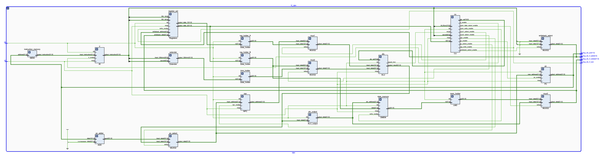

# HIT_CPU_design
哈工大2023处理器设计和计算机体系结构实验verilog设计代码和激励文件。处理器设计在开学的前两周开设，是计算机体系结构实验的前置课程，故将两个实验的内容放在一起。
- 处理器设计是哈工大2023年第一次开设的课程，在这里把verilog设计代码分享给大家，仅供参考。
Lab1-3中每个文件夹有两个文件，其中一个为设计文件，另一个有下划线标注后缀的为激励文件。在Lab4中，有两个文件夹，其中source文件夹中为设计文件，sim文件夹中为测试文件。设计文件中初始化数据文件的路径已被隐去，请自行添加。 \
哈工大处理器设计实验要求：https://hit-coa.gitlab.io/hit-cdp-lab/intro/intro.html
- 计算机体系结构共有3个实验，在这里将verilog的代码分享给大家，仅供大家参考，拓宽思路。
实验的设计文件和仿真文件在每个实验对应的文件夹下，其中测试用例的路径已隐去，具体使用的测试用例已在说明中给出。 \
哈工大计算机体系结构实验要求：https://hit-coa.gitlab.io/archlab/


## 处理器设计实验

### CPU_design_Lab1 ###
Lab1共有两个实验，选择器和节拍发生器。

### CPU_design_Lab2 ###
Lab2为模拟ALU。


### CPU_design_Lab3 ###
Lab3共有两个实验，寄存器堆和RAM。寄存器堆比较好实现，RAM需要导入IP核，在导入的时候注意，要严格按照指导书进行，否则可能出现问题。

### CPU_design_Lab4 ###
Lab4为MIPS无流水CPU设计，用verilog完成CPU，可执行主要的MIPS指令。设计的CPU结构如下：

Lab4文件夹内有处理器设计文件和仿真文件两个文件夹，仿真文件为测试样例，当输出"--PASS"时即为成功。设计文件中从外部导入的初值已被隐去，请自行设置初值的路径。测试的指令如下：
``` 
// 非流水线CPU实验测试

LW   $1,  4($0)
LW   $2,  8($0)
ADD  $3,  $1,  $2
SUB  $4,  $1,  $2
AND  $5,  $1,  $2
OR   $6,  $1,  $2
XOR  $7,  $1,  $2
SLT  $8,  $1,  $2
SLL  $9,  $1,  0x2  // $9 <- $1 << 2
SW   $1,  8($0)
SW   $2,  4($0)
BNE  $0,  $6,  0x2  // taken to 0x38
SW   $1,  0($0)
J    0              // back to start
J    0x10           // jumps to 0x40
SW   $1,  0($0)
LW   $0,  0($0)
NOP
J    0              // back to start
``` 

## 计算机体系结构实验

### Computer_Architecture_Lab1 ###
*!!!注意：本实验完成时参考了一些网上已有的开源处理器体系结构设计方案，但想要引用此参考资料时，却已找不到。若有相关问题，请与我联系。* 

Lab1为设计一个五级流水MIPS CPU，可以执行主要的MIPS指令，具体的体系结构如下图所示：

设计文件在source文件夹内，仿真文件在sim文件夹内。关于流水线CPU的具体设计方案以及各个部件的实现原理，请到<a href='./Computer_architecture_lab1/README.md'>这里</a>查看。 \
所使用的测试用例为：
#### 基础测试

```
寄存器：  全0

数据存储器：
for i in range(0, 84, 4):
    Mem[i] = i >> 2

指令缓冲：
0x0000:  8C 01 00 04    lw  $1, 4($0)       // $1 <= 0x1
0x0004:  8C 02 00 08    lw  $2, 8($0)       // $2 <= 0x2
0x0008:  8C 03 00 0C    lw  $3, 0xc($0)     // $3 <= 0x3
0x000c:  8C 04 00 10    lw  $4, 0x10($0)    // $4 <= 0x4
0x0010:  8C 05 00 14    lw  $5, 0x14($0)    // $5 <= 0x5
0x0014:  00 22 20 20    add $4, $1, $2      // $4 <= 0x3
0x0018:  00 23 28 20    add $5, $1, $3      // $5 <= 0x4
0x001c:  8C 01 00 30    lw  $1, 0x30($0)    // $1 <= 0xc
0x0020:  00 00 00 00    nop
0x0024:  00 00 00 00    nop
0x0028:  00 00 00 00    nop
0x002c:  8C 22 00 04    lw  $2, 4($1)       // $2 <= 0x4
0x0030:  8C 23 00 08    lw  $3, 8($1)       // $3 <= 0x5
0x0034:  00 00 00 00    nop
0x0038:  8C AD 00 10    lw  $13, 0x10($5)   // $13 <= 0x5
0x003c:  00 00 00 00    nop
0x0040:  00 64 28 20    add $5, $3, $4      // $5 <= 0x8
0x0044:  00 62 30 20    add $6, $3, $2      // $6 <= 0x9
0x0048:  00 01 71 00    sll $14, $1, 0x4    // $14 <= 0xc0
0x004c:  01 AD 68 26    xor $13, $13, $13   // $13 <= 0x0
0x0050:  00 C1 78 0A    movz $15, $6, $1    // 不写回
0x0054:  00 C5 48 22    sub $9,  $6, $5     // $9  <= 0x1
0x0058:  00 C3 50 22    sub $10, $6, $3     // $10 <= 0x4
0x005c:  00 CD 78 0A    movz $15, $6, $13   // $15 <= 0x9
0x0060:  AC 23 00 10    sw  $3, 0x10($1)    // M[0x1c] <= 0x5
0x0064:  00 00 00 00    nop
0x0068:  8D 4B 00 00    lw  $11, ($10)      // $11 <= 0x1
0x006c:  8D 4C 00 08    lw  $12, 8($10)     // $12 <= 0x3
```

#### 附加测试1

```
寄存器：全0

数据存储器：
for i in range(0, 124, 4):
    Mem[i] = i

指令缓冲：
0x0000:  8C 0A 00 04    lw   $10, 4($0)         // $10 <= 0x4
0x0004:  8D 4C 00 04    lw   $12, 4($10)        // $12 <= 0x8
0x0008:  01 8C 70 20    add  $14, $12, $12      // $14 <= 0x10
0x000c:  8D CA 00 08    lw   $10, 8($14)        // $10 <= 0x18
0x0010:  8D CC 00 0C    lw   $12, 0xc($14)      // $12 <= 0x1c
0x0014:  01 8A 70 20    add  $14, $12, $10      // $14 <= 0x34
0x0018:  8D CA 00 0C    lw   $10, 0xc($14)      // $10 <= 0x40
0x001c:  8D 8C 00 0C    lw   $12, 0xc($12)      // $12 <= 0x28
0x0020:  01 4C 70 20    add  $14, $10, $12      // $14 <= 0x68
0x0024:  8D 8A 00 10    lw   $10, 0x10($12)     // $10 <= 0x38
0x0028:  8D CC 00 10    lw   $12, 0x10($14)     // $12 <= 0x78
0x002c:  01 4A 70 20    add  $14, $10, $10      // $14 <= 0x70
0x0030:  01 CA 78 20    add  $15, $14, $10      // $15 <= 0xa8
0x0034:  01 E0 90 20    add  $18, $15, $0       // $18 <= 0xa8
0x0038:  02 52 78 20    add  $15, $18, $18      // $15 <= 0x150
0x003c:  01 CC 78 20    add  $15, $14, $12      // $15 <= 0xe8
0x0040:  01 EC 90 20    add  $18, $15, $12      // $18 <= 0x160
0x0044:  02 4F 78 20    add  $15, $18, $15      // $15 <= 0x248
0x0048:  01 40 80 20    add  $16, $10, $0       // $16 <= 0x38
0x004c:  02 0A 90 20    add  $18, $16, $10      // $18 <= 0x70
0x0050:  02 00 90 20    add  $18, $16, $0       // $18 <= 0x38
0x0054:  00 0C 78 20    add  $15, $0,  $12      // $15 <= 0x78
0x0058:  01 F2 A0 20    add  $20, $15, $18      // $20 <= 0xb0
0x005c:  02 8F 90 20    add  $18, $20, $15      // $18 <= 0x128
0x0060:  8E 0A 00 04    lw   $10, 4($16)        // $10 <= 0x3c
0x0064:  8D 4C FF FC    lw   $12, -4($10)       // $12 <= 0x38
0x0068:  01 80 98 0A    movz $19, $12, $0       // $19 <= 0x38
0x006c:  8E 6A 00 04    lw   $10, 4($19)        // $10 <= 0x3c
0x0070:  8D 4C 00 08    lw   $12, 8($10)        // $12 <= 0x44
0x0074:  01 8A 98 0A    movz $19, $12, $10      // 不写回
0x0078:  02 10 78 22    sub  $15, $16, $16      // $15 <= 0x0
0x007c:  02 94 90 20    add  $18, $20, $20      // $18 <= 0x160
0x0080:  02 4F 98 0A    movz $19, $18, $15      // $19 <= 0x160
0x0084:  02 0F 78 20    add  $15, $16, $15      // $15 <= 0x38
0x0088:  02 94 90 20    add  $18, $20, $20      // $18 <= 0x160
0x008c:  02 4F 98 0A    movz $19, $18, $15      // 不写回
0x0090:  00 00 88 0A    movz $17, $0,  $0       // $17 <= 0x0
0x0094:  02 32 A0 0A    movz $20, $17, $18      // 不写回
0x0098:  02 91 98 0A    movz $19, $20, $17      // $19 <= 0xb0
```


#### 附加测试2
```
寄存器：全0

数据存储器：
for i in range(0, 124, 4):
    Mem[i] = i

指令缓冲：
0x0000:  8D 6A 00 04    lw   $10, 4($11)         // $10 <= 0x04
0x0004:  01 4A 60 20    add  $12, $10, $10       // $12 <= 0x08
0x0008:  01 8C 78 20    add  $15, $12, $12       // $15 <= 0x10
0x000c:  8D 6A 00 08    lw   $10, 8($11)         // $10 <= 0x08
0x0010:  01 4A 60 20    add  $12, $10, $10       // $12 <= 0x10
0x0014:  01 8A 78 20    add  $15, $12, $10       // $15 <= 0x18
0x0018:  8D 6A 00 0C    lw   $10, 0xc($11)       // $10 <= 0x0c
0x001c:  01 4A 60 20    add  $12, $10, $10       // $12 <= 0x18
0x0020:  01 4C 78 20    add  $15, $10, $12       // $15 <= 0x24
0x0024:  8D 6A 00 10    lw   $10, 0x10($11)      // $10 <= 0x10
0x0028:  01 4A 60 20    add  $12, $10, $10       // $12 <= 0x20
0x002c:  01 4A 78 20    add  $15, $10, $10       // $15 <= 0x20
0x0030:  02 32 80 20    add  $16, $17, $18       // $16 <= 0x00
0x0034:  8E 93 00 04    lw   $19, 4($20)         // $19 <= 0x04
0x0038:  02 73 50 20    add  $10, $19, $19       // $10 <= 0x08
0x003c:  02 32 80 20    add  $16, $17, $18       // $16 <= 0x00
0x0040:  8E 93 00 08    lw   $19, 8($20)         // $19 <= 0x08
0x0044:  02 70 50 20    add  $10, $19, $16       // $10 <= 0x08
0x0048:  02 32 80 20    add  $16, $17, $18       // $16 <= 0x00
0x004c:  8E 93 00 0C    lw   $19, 0xc($20)       // $19 <= 0x0c
0x0050:  02 13 50 20    add  $10, $16, $19       // $10 <= 0x0c
0x0054:  02 32 80 20    add  $16, $17, $18       // $16 <= 0x00
0x0058:  8E 93 00 10    lw   $19, 0x10($20)      // $19 <= 0x10
0x005c:  02 10 50 20    add  $10, $16, $16       // $10 <= 0x00
0x0060:  01 60 50 0A    movz $10, $11, $0        // $10 <= 0x00
0x0064:  8D 53 00 04    lw   $19, 4($10)         // $19 <= 0x04
0x0068:  01 53 60 20    add  $12, $10, $19       // $12 <= 0x04
0x006c:  01 6B 60 20    add  $12, $11, $11       // $12 <= 0x00
0x0070:  8D 73 00 08    lw   $19, 8($11)         // $19 <= 0x08
0x0074:  02 60 50 0A    movz $10, $19, $0        // $10 <= 0x08
```


## 参考资料
- <a href="https://verilogguide.readthedocs.io/en/latest/">FPGA designs with Verilog</a>
- <a href="https://blog.csdn.net/zhang_qing_yun/article/details/121049946">设计并实现一个单周期非流水的CPU（哈工大计组实验二：给定指令系统的处理器设计）</a>
- 感谢<a href="https://claude.ai/chats">Claude</a>对项目的大力支持